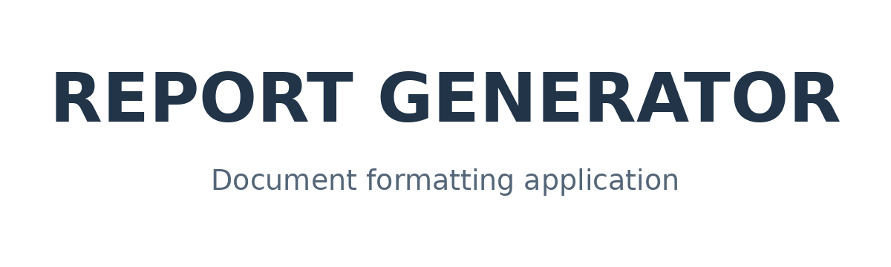
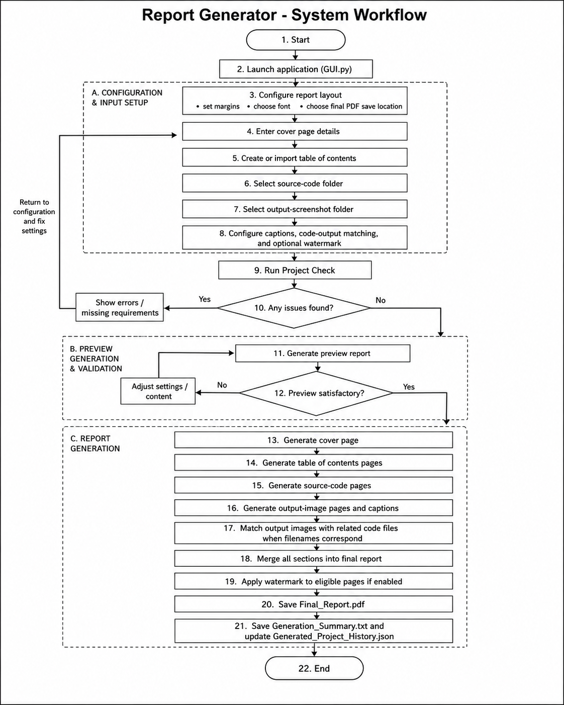

# Report Generator



A Python desktop application for turning source-code files and program-output screenshots into properly structured PDF project reports. The application uses a PyQt6 graphical interface and supports report setup, preview, validation, and final PDF generation.

---

## Core Idea

The core idea of this project is to automate the repeated formatting work required when preparing programming and laboratory reports.

Instead of manually creating the cover page, table of contents, code pages, output pages, captions, and watermark, the user provides the required details and files. The application then organizes everything and generates one complete PDF report.

---

## Problem Statement

Preparing programming and laboratory reports often involves repetitive tasks such as formatting source code, arranging screenshots, creating cover pages, preparing tables of contents, and maintaining consistent document layouts.

Report Generator was developed to automate this process by allowing users to organize their source code and output screenshots and generate a structured PDF report through a desktop interface. The application was initially designed around academic lab report requirements but can be adapted for similar documentation workflows.

---

## Project Purpose

Preparing programming reports manually requires the same tasks to be repeated for every practical assignment. Students must create a front page, prepare a table of contents, copy source code, resize output screenshots, add captions, maintain page margins, and merge everything into one document.

This project reduces that manual work through a desktop application that manages the complete report-generation process. It helps the user create reports faster while maintaining a consistent structure and appearance.

---

## Main Features

### Report layout

- Set custom top, bottom, left, and right page margins.
- Use the default margin settings when custom values are not required.
- Select Times New Roman or Arial for the generated report.
- Generate the completed report in PDF format.
- Select the name and location of the final PDF file.

### Cover page

- Generate an optional academic cover page.
- Add the college name and address.
- Add the student name, roll number, section, and semester.
- Add the teacher name and project title.
- Use the default logo or select another logo.
- Check required cover-page fields before report generation.

### Table of contents

- Generate an optional table of contents.
- Enter the contents manually.
- Import contents from a TXT file.
- Import contents from a DOCX file.
- Keep existing labels and numbering when required.
- Automatically prepare table-of-contents pages for the report.

### Source-code pages

- Select a folder containing source-code files.
- Scan readable source files inside the selected folder and its subfolders.
- Arrange source files using natural filename order.
- Display the source filename with its code.
- Control the line height used on code pages.
- Wrap long code lines so they remain inside the page margins.
- Ignore binary files, images, archives, documents, and generated files.

### Output screenshots

- Select a folder containing program-output screenshots.
- Support PNG, JPG, JPEG, BMP, and WEBP images.
- Create formatted output pages automatically.
- Add figure numbers to output images.
- Use image filenames as captions.
- Enter manual captions for individual images.
- Generate output pages without captions when required.
- Refresh, save, or clear manually entered captions.

### Code and output matching

- Match source-code files with output images using their base filenames.
- Place a matching output screenshot directly after its related code file.
- Report code files that do not have matching output images.
- Report output images that do not have matching code files.
- Keep unmatched files available in the final report.

### Watermark

- Add an optional text watermark.
- Apply the watermark to report-content pages.
- Keep the cover page and table of contents without a watermark.

### Preview and validation

- Run a Project Check before generating the report.
- Detect missing folders, files, fonts, and required information.
- Generate a preview PDF before final export.
- View preview pages inside the application.
- Move between preview pages.
- Open the preview or final PDF in the computer's PDF viewer.
- Display generation progress while the report is being created.

### Configuration and history

- Save the current report configuration.
- Import a previously saved configuration.
- Store application settings in JSON files.
- Generate a summary after report creation.
- Keep a history of previously generated reports.
- Open selected source-code and screenshot folders from the application.

---

## How the System Works

1. The user starts the application by running `GUI.py`.
2. The user configures margins, font, and the final PDF location.
3. The user enters the cover-page information.
4. The user creates or imports the table of contents.
5. The user selects the source-code folder.
6. The user selects the output-screenshot folder.
7. The user chooses caption, matching, and watermark options.
8. The application scans and validates the selected files.
9. The user runs **Project Check** to identify missing requirements.
10. The application generates a preview PDF.
11. The user reviews the preview and makes any required changes.
12. The cover page, table of contents, source-code pages, and output pages are generated.
13. Related code and output files are arranged according to their filenames.
14. The selected watermark is applied to eligible pages.
15. All report sections are merged into one final PDF.
16. A generation summary and report-history entry are saved.

---

## System Workflow



---

## Demo Video

A complete demonstration of the application is included in the project folder:

[Watch the Project Demo](DemoVideo.mp4)

---

## Technologies Used

| Part | Technology |
|---|---|
| Programming language | Python |
| Desktop interface | PyQt6 |
| PDF creation | ReportLab |
| PDF reading and merging | pypdf |
| PDF preview | PyMuPDF |
| Image processing | Pillow |
| DOCX content import | python-docx |
| Configuration storage | JSON |
| Final output | PDF |

The application does not require a database, web server, or internet connection for normal report generation.

---

## Supported Files

| Purpose | Supported files |
|---|---|
| Table-of-contents import | TXT, DOCX |
| Output screenshots | PNG, JPG, JPEG, BMP, WEBP |
| Source code | Readable text-based source-code files |
| Saved settings | JSON |
| Generated report | PDF |

Binary files, compressed archives, office documents, executables, images, and hidden files are ignored when the source-code folder is scanned.

---

## Important Project Files

```text
Report_Generator/
├── Assets/
│   └── Icons/                         GUI icons
├── Default_Code_Folder/               Default source-code folder
├── Default_Output_Snapshot_Folder/    Default output-screenshot folder
├── Fonts/                             Required PDF font files
├── FrontPage/                         Generated cover-page files
├── JsonFile/                          Application configuration files
├── Table_Of_Content/                  Generated table-of-contents files
├── CodeGenerator.py                   Creates formatted source-code pages
├── FrontPageGenerator.py              Creates the report cover page
├── GUI.py                             Main desktop application
├── OutputGenerator.py                 Builds and combines the final PDF
├── PreviewGenerator.py                Creates the preview report
├── RandomOutputTextFinal.py           Provides helper output-page text
├── TableofContentGenerator.py         Creates table-of-contents pages
├── DemoVideo.mp4                      Project demonstration video
├── logo.png                           Default report logo
├── requirements.txt                   Required Python packages
└── README.md                          Project documentation
```

---

## Requirements

- Python 3
- PyQt6
- Pillow
- ReportLab
- pypdf
- PyMuPDF
- python-docx

The exact tested package versions are provided in `requirements.txt`.

```text
Pillow==12.2.0
reportlab==4.4.9
pypdf==5.9.0
PyMuPDF==1.26.7
PyQt6==6.11.0
python-docx==1.2.0
```

---

## Installation

### Clone the repository

```bash
git clone https://github.com/ShiveshShrestha/Projects.git
cd Projects/Report_Generator
```

### Create a virtual environment

```bash
python -m venv .venv
```

### Activate the virtual environment

#### Windows Git Bash

```bash
source .venv/Scripts/activate
```

#### Windows Command Prompt

```bat
.venv\Scripts\activate
```

#### Linux or macOS

```bash
source .venv/bin/activate
```

### Install the required packages

```bash
python -m pip install --upgrade pip
pip install -r requirements.txt
```

---

## Required Font Files

Before running the application, add the required `.ttf` font files to the `Report_Generator/Fonts/` folder.

The folder must contain:

```text
Fonts/
├── times.ttf
├── timesbd.ttf
├── arial.ttf
└── arialbd.ttf
```

These font files are not included in the repository because of font-licensing restrictions. Use legally obtained copies and keep the filenames exactly as shown.

Incorrect or missing filenames may cause a missing-font error during preview or final report generation.

---

## Running the Application

Run the following command from inside the `Report_Generator` folder:

```bash
python GUI.py
```

Running the application from a terminal is recommended because any startup error will be visible there.

---

## How to Use the Application

1. Launch the application using `python GUI.py`.
2. Open the **Layout** section.
3. Select the required page margins and report font.
4. Open **Cover & Contents**.
5. Enter the front-page information.
6. Enter or import the table of contents.
7. Open the **Code** section.
8. Select the folder containing source-code files.
9. Set the required code-page line height.
10. Open **Output Images**.
11. Select the folder containing program-output screenshots.
12. Select the required caption style.
13. Enable filename matching when output images should follow related code files.
14. Add watermark text when required.
15. Select the final PDF location.
16. Run **Project Check**.
17. Select **Preview Report** and review the generated preview.
18. Correct any issues found during the preview.
19. Select **Generate Report** to create the final PDF.

---

## Default Folders

### Source-code files

Place source-code files inside:

```text
Default_Code_Folder/
```

The application can also use another source-code folder selected through the interface.

### Output screenshots

Place output screenshots inside:

```text
Default_Output_Snapshot_Folder/
```

The application accepts:

```text
.png
.jpg
.jpeg
.bmp
.webp
```

The application can also use another screenshot folder selected through the interface.

---

## Matching Code and Output Files

To place an output screenshot immediately after its related source-code file, use the same base filename for both files.

Example:

```text
Source code: Lab1_HashTagNoob.java
Screenshot:  Lab1_HashTagNoob.png
```

The file extensions can be different. The application compares the names without their extensions.

Enable **Place Output After Code** to use this arrangement.

---

## Files Generated by the Application

Running the application may create the following files:

```text
Final_Report.pdf
Preview_Report.pdf
Generation_Summary.txt
Project_Health_Check.txt
Generated_Project_History.json
saved_report_configuration.json
```

Temporary PDF, image, summary, history, and configuration files are excluded through `.gitignore` because they are generated during normal application use.

---

## Configuration Files

Application settings are stored inside the `JsonFile/` folder:

```text
JsonFile/
├── config_data.json
├── code_page.json
├── frontpage.json
├── table_of_content.json
├── output_captions.json
└── watermark.json
```

The interface manages these files automatically, so they normally do not need to be edited manually.

Additional runtime configuration files may be created after settings are saved or imported.

---

## What Each Main File Does

### `GUI.py`

Provides the main PyQt6 interface and connects the complete application workflow. It manages navigation, settings, validation, previews, report generation, configuration import and export, summaries, and history.

### `CodeGenerator.py`

Reads source-code files and converts them into formatted report pages. It scans subfolders, orders files, wraps long lines, and creates code-page information used during final assembly.

### `FrontPageGenerator.py`

Creates the report cover page using the college, student, teacher, project, logo, and font information entered through the application.

### `TableofContentGenerator.py`

Creates the table-of-contents pages using manually entered or imported content.

### `PreviewGenerator.py`

Generates a temporary preview report so the user can inspect the selected layout and content before creating the final PDF.

### `OutputGenerator.py`

Creates output-image pages, adds captions, matches screenshots with source-code files, applies the watermark, merges all report sections, and writes the generation summary.

### `RandomOutputTextFinal.py`

Provides helper text used while preparing output-image pages.

---

## Project Check

The **Project Check** feature helps identify report-generation problems before the preview or final PDF is created.

It can check for issues such as:

- Missing font files
- Invalid or missing folders
- Missing source-code files
- Missing output screenshots
- Incomplete cover-page information
- Invalid margin values
- Missing watermark text
- Missing table-of-contents information
- Incorrect final-report location
- Code and output filename mismatches

The result is stored in:

```text
Project_Health_Check.txt
```

---

## Generation Summary

After a report is generated, the application creates:

```text
Generation_Summary.txt
```

The summary may include:

- Final report location
- Number of source-code files
- Number of output images
- Number of manual captions
- Watermark status
- Code-output matching status
- Number of matching filenames
- Code files without output images
- Output images without source-code files
- Number of pages excluded from watermarking

---

## Troubleshooting

### Missing font error

Check that all four required `.ttf` files exist inside `Report_Generator/Fonts/` and that their filenames exactly match:

```text
times.ttf
timesbd.ttf
arial.ttf
arialbd.ttf
```

### Package not found

Activate the virtual environment and run:

```bash
pip install -r requirements.txt
```

### Output images are not appearing

Check that the selected screenshot folder contains supported image files:

```text
PNG, JPG, JPEG, BMP, or WEBP
```

### Source code is not appearing

Check that the selected code folder contains readable text-based source-code files.

### Code and output files are not matching

Make sure both files use the same base filename.

Example:

```text
Program1.py
Program1.png
```

### Application does not start

Run the application from a terminal:

```bash
python GUI.py
```

The terminal will display the related error message.

### Preview or final report is not generated

Run **Project Check** and review `Project_Health_Check.txt` for missing requirements.

---

## Current Limitations

The current version does not include:

- Export to Microsoft Word or other document formats
- Source-code syntax highlighting
- Automatic correction of source-code errors
- Drag-and-drop file selection
- Cloud storage or online synchronization
- Multi-user accounts
- Automatic backup of previous generated reports
- Editing of individual PDF pages inside the application
- Automatic extraction of source code from images or PDF files

---

## Future Enhancements

Possible future improvements include:

- Additional export formats
- Better installation and dependency checks
- Support for more fonts
- Source-code syntax highlighting
- Drag-and-drop file selection
- More report templates
- Automatic backup and version history
- Improved code-output matching
- Direct Word-document export

---

## Author

**Shivesh Shrestha**


---

## Summary

This project provides a complete desktop workflow for generating academic programming reports. It prepares the cover page and table of contents, formats source-code files, adds output screenshots and captions, matches related files, applies an optional watermark, validates the project, previews the result, and combines everything into one organized PDF report.
